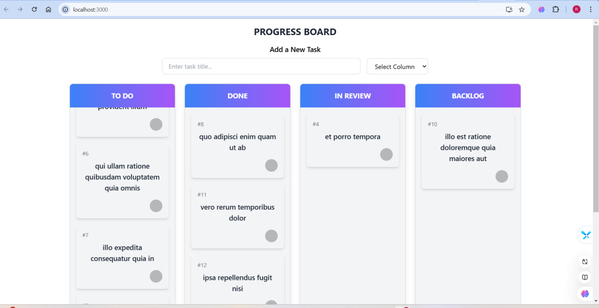

# Kanban Board Project

A fully functional **Kanban Board** built using **React JS** and **Tailwind CSS**. This project includes drag-and-drop functionality, a task management system, and the ability to dynamically add new tasks to different columns.

---

## Features

### 1. **Add Task**
- Add new tasks dynamically using the input form.
- Assign tasks to specific columns such as **To Do**, **Done**, **In Review**, or **Backlog**.

### 2. **Drag and Drop Tasks**
- Move tasks between columns with drag-and-drop functionality.
- Powered by `react-beautiful-dnd` for a seamless and smooth experience.

### 3. **Responsive Design**
- Fully responsive layout for both desktop and mobile screens.
- Styled using **Tailwind CSS** for consistency and ease of customization.

---

## Technologies Used

- **React JS**: For building the user interface and managing the state.
- **Tailwind CSS**: For modern, responsive styling.
- **react-beautiful-dnd**: For drag-and-drop task functionality.

---

## Setup Instructions

### Prerequisites
Ensure you have the following installed on your machine:
1. **Node.js** (v14 or above)
2. **npm** or **yarn**

### Installation
1. Clone the repository:
   ```bash
   git clone <repository_url>
   cd <repository_folder>
   ```

2. Install dependencies:
   ```bash
   npm install
   # or
   yarn install
   ```

3. Start the development server:
   ```bash
   npm start
   # or
   yarn start
   ```

4. Open the app in your browser at `http://localhost:3000`.

---

## Usage

### Add a New Task
1. Enter a task title in the **input field**.
2. Select the column where the task belongs using the **dropdown menu**.
3. The task will appear in the selected column immediately.

### Drag and Drop Tasks
1. Hover over a task to reveal the **drag handle**.
2. Drag the task to another column and drop it.
3. The task will be moved to the new column seamlessly.

---

## Example Screenshots

### Kanban Board Overview



---